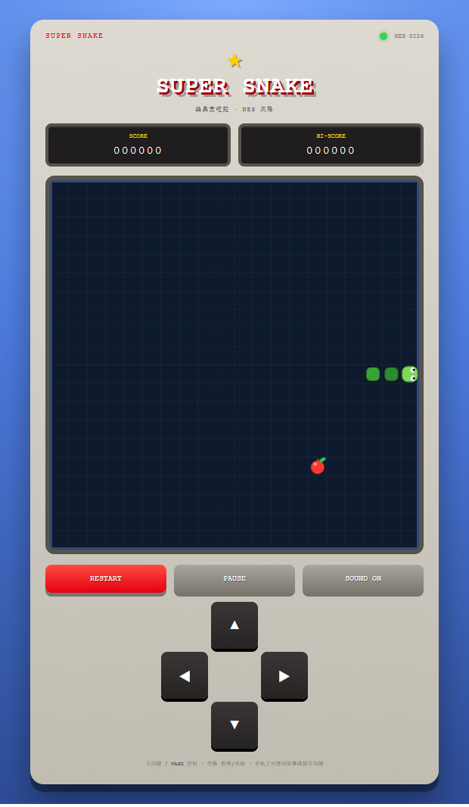

# 贪吃蛇游戏（SUPER SNAKE）

一个任天堂 NES 风格的经典贪吃蛇小游戏，用纯网页技术（HTML + CSS + JavaScript）制作，无需安装任何东西。

## 如何运行

直接用浏览器打开 `index.html` 即可游玩。

## 操作说明

- 键盘：方向键（↑ ↓ ← →）或 WASD 控制移动，空格开始 / 暂停
- 手机：在屏幕上滑动控制方向，轻点屏幕开始 / 暂停，也可以使用页面上的方向键（D-pad）
- 吃到苹果蛇会变长，分数 +10，速度会逐渐加快
- 撞到墙壁或咬到自己游戏结束
- 最高分会自动保存在本机浏览器中

## 游戏特性

- NES 红白机风格界面：像素字体、红白配色、扫描线屏幕
- 8-bit 复古音效（可静音）
- 开始 / 暂停 / 重新开始
- 计分与加速、最高分记录
- 支持键盘、鼠标和触屏操作

## 项目文件

- `index.html` — 游戏页面
- `style.css` — NES 风格样式
- `game.js` — 游戏逻辑与音效

## 开发计划

- [x] 基础游戏逻辑（移动、吃食物、碰撞检测）
- [x] 计分与加速
- [x] 开始 / 暂停 / 重新开始
- [x] 界面美化（NES 风格）
